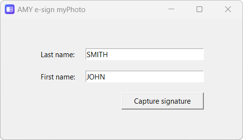
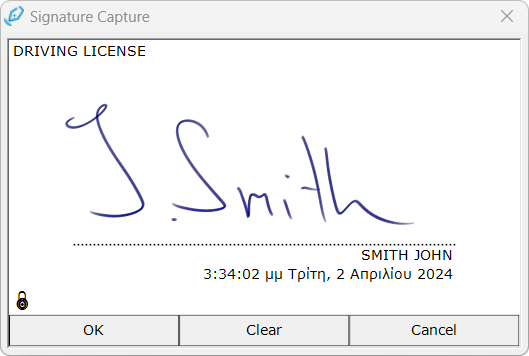
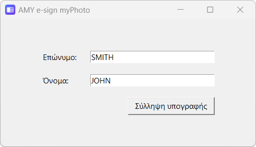
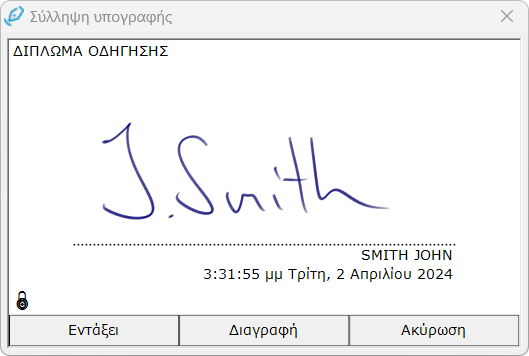

  <picture>
    
    </picture>

<h1 align="center">
  AMY e-sign myPhoto 
</h1>

AMY e-sign myPhoto is an app for capturing signature images according to the
[myPhoto](https://www.gsis.gr/polites-epiheiriseis/stoiheia-politon-kai-taytopoiitika-eggrafa/myPhoto)
[specifications](https://www.gsis.gr/sites/default/files/myPhoto/specifications.pdf)
of the Greek Government with
[Wacom](https://www.amyshop.gr/wacom-hlektronikh-ypografh)
devices.
The app is free of charge without official support.
If you would like to receive paid support, please contact
[AMY S.A.](https://www.amyshop.gr/epikoinonia).
If you are interested in signing PDF documents with biometric signatures, 
please have a look at the application
[AMY e-sign](https://www.amyshop.gr/amy-e-sign).

---

Το AMY e-sign myPhoto είναι μια εφαρμογή για τη λήψη εικόνων υπογραφής σύμφωνα
με τις
[προδιαγραφές](https://www.gsis.gr/sites/default/files/myPhoto/specifications.pdf)
του
[myPhoto](https://www.gsis.gr/polites-epiheiriseis/stoiheia-politon-kai-taytopoiitika-eggrafa/myPhoto)
της Ελληνικής Κυβέρνησης με συσκευές
[Wacom](https://www.amyshop.gr/wacom-hlektronikh-ypografh).
Η εφαρμογή είναι δωρεάν χωρίς επίσημη υποστήριξη.
Εάν θέλετε να λάβετε υποστήριξη επί πληρωμή, παρακαλώ επικοινωνήστε με την
[AMY Α.Ε.](https://www.amyshop.gr/epikoinonia).
Εάν ενδιαφέρεστε να υπογράψετε έγγραφα PDF με βιομετρικές υπογραφές, ρίξτε μια
ματιά στην εφαρμογή
[AMY e-sign](https://www.amyshop.gr/amy-e-sign).

## Supported OS / Υποστηριζόμενα λειτουργικά συστήματα

* Windows 10 / 11 (64-bit)

## Required Dependencies / Απαιτούμενες εξαρτήσεις

The app requires the 
[Wacom Signature SDK](https://developer-docs.wacom.com/docs/sdk-for-signature/guides/download/)
to be installed.
If you are using a STU device, you need to install the
[Wacom STU Driver](https://developer-support.wacom.com/hc/en-us/articles/9354527258007-STU-Driver-Installation).
For all other Wacom devices you need to install the 
[Wacom Tablet Driver](https://www.wacom.com/en-us/support/product-support/drivers).

---

Η εφαρμογή απαιτεί την εγκατάσταση του
[Wacom Signature SDK](https://developer-docs.wacom.com/docs/sdk-for-signature/guides/download/).
Εάν χρησιμοποιείτε συσκευή STU, πρέπει να εγκαταστήσετε τον οδηγό
[Wacom STU Driver](https://developer-support.wacom.com/hc/en-us/articles/9354527258007-STU-Driver-Installation).
Για όλες τις άλλες συσκευές Wacom πρέπει να εγκαταστήσετε τον οδηγό
[Wacom Tablet Driver](https://www.wacom.com/en-us/support/product-support/drivers).

## Usage / Χρήση

Download the latest version of the
[app](https://github.com/stefanoschalkidis/esign-myphoto/releases/download/v1.0.1/esign_myphoto_v1.0.1.zip)
packaged as zip.
Unzip the content to your desktop.
Double-click the file ***amy_e-sign_myphoto.exe*** in the unzipped folder to
start the application.
A window will open for you to enter the signer's last and first name.

Press the *Capture signature* button after you have entered the details to open
the signature capture window.

Press *OK* after the signature has been applied to save the signature.
The signature is saved to the **output** folder next to the file
***amy_e-sign_myphoto.exe***.

---

Κατεβάστε την τελευταία έκδοση της
[εφαρμογής](https://github.com/stefanoschalkidis/esign-myphoto/releases/download/v1.0.1/esign_myphoto_v1.0.1.zip)
σε μορφή zip.
Αποσυμπιέστε το περιεχόμενο στην επιφάνεια εργασίας σας.
Κάντε διπλό κλικ στο αρχείο ***amy_e-sign_myphoto.exe*** στο φάκελο που έχει
αποσυμπιεστεί για να εκκινήσετε την εφαρμογή.
Θα ανοίξει ένα παράθυρο για να εισαγάγετε το επώνυμο και το όνομα του
υπογράφοντος.

Πατήστε το κουμπί *Σύλληψη υπογραφής* αφού εισαγάγετε τα στοιχεία για να ανοίξει
το παράθυρο σύλληψης υπογραφής.

Πατήστε *Εντάξει* μετά τη σύλληψη της υπογραφής για να αποθηκεύσετε την
υπογραφή.
Η υπογραφή αποθηκεύεται στο φάκελο **output** δίπλα στο αρχείο
***amy_e-sign_myphoto.exe***.

## License / Άδεια

Licensed under the [MIT License](LICENSE.txt).

Copyright (C) 2024 AMY S.A. All Rights Reserved
